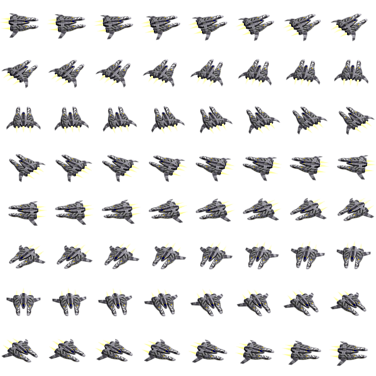

# 2D Sprite Sheets for Ships

Although it is usually preferable to [use 3D graphics](./3d.md), you can use 2D graphics for a more classic look instead.
Ship graphics are defined in the `<gfx>` node as a string with additional attributes like number of sprites or size also defined in the `XML`.
Graphics for each ship are stored in a directory found in `gfx/ship/`, where the base graphics, engine glow graphics, and comm window graphics are placed separately with specific file names.

Graphics used by a ship are defined in the ship definition using the `gfx` tag, in combination with the `base_type` tag.
For example, the Llama ship graphics are defined as follows
```xml
 <base_type>Llama</base_type>
 <gfx>llama</gfx>
```
The specific graphics are then searched for inside the directory with the full `GFX` string value and a specific prefix.
Assuming `GFX` is the graphics name and `DIR` is the directory name (up to first underscore in `GFX`), we get (extension is auto-detected if omitted):

* `gfx/ship/DIR/GFX`: ship base graphic file
* `gfx/ship/DIR/GFX_engine`: ship engine glow graphics file
* `gfx/ship/DIR/GFX_comm`: ship communication graphics (used in the comm window)

For the Llama ship you would end up with (assuming they are `avif` files, you can use webp or `png` instead):
* `gfx/ship/Llama/llama.avif`
* `gfx/ship/Llama/llama_engine.avif`
* `gfx/ship/Llama/llama_comm.avif`

The base graphics are stored as a sprite-sheet and start facing right before spinning counter-clockwise.
The top-left sprite faces to the right, and it rotates across the row first before going down to the next row.
The background should be stored in _RGBA_ with a transparent background.
An example is shown below:

 <br/>
*Example of the ship graphics for the "Llama".
Starting from top-left position, and going right first before going down, the ship rotates counter-clockwise and starts facing right.
A black background has been added for visibility.*

The engine glow graphics are similar to the base graphics, but should show engine glow of the ship.
This graphic gets used instead of the normal graphic when accelerated with some interpolation to fade on and off.
An example is shown below;

<br/>
*Example of the engine glow graphics for the "Llama".
Notice the yellow glow of the engines.
A black background has been added for visibility.*

The comm graphics should show the ship facing the player and be higher resolution.
This image will be shown in large when the player communicates with them.
An example is shown below:

<br/>
*Example of the comm graphics for the "Llama".*

## Important Attributes

TODO

## Specifying Full Paths

It is also possible to avoid all the path logic in the `<gfx>` nodes by specifying the graphics individually using other nodes.
In particular, you can use the following nodes in the `XML` in place of a single `<gfx>` node to specify graphics:

* `<gfx_space>`: Indicates the full path to the base graphics (`gfx/` is prepended).
  The `sx` and `sy` attributes should be specified, or they default to 8.
* `<gfx_engine>`: Indicates the full path to the engine glow graphics (`gfx/` is prepended).
  The `sx` and `sy` attributes should be specified, or they default to 8.
* `<gfx_comm>`: Indicates the full path to the comm graphics (`gfx/` is prepended).

This gives more flexibility and allows using, for example, station graphics of a spob for a "ship".
